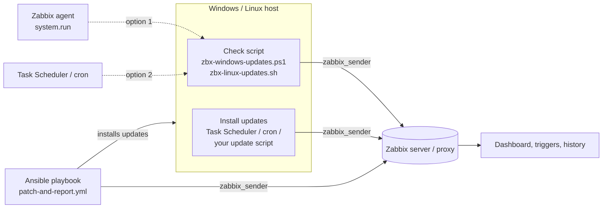

# Zabbix – Patch management for Windows and Linux (dashboard, check scripts, Ansible)

Zabbix 7.4 templates and scripts to see the **update status of all your Windows and Linux servers in one place**: how many updates are pending (critical, security, …), which ones, whether a reboot is needed, when updates were last installed and with what result.


*Example dashboard built from the data of these templates: all hosts with pending updates by category, reboot needed, WSUS status, last check, last install run and result; totals, servers with / without updates over a year, average uptime.*

- 🕵️ **The screenshot is anonymized.** In the real dashboard you see your **real host names** instead of *SERVER-01, 02, …*. **Click a host** to open its details and the full history of its updates in Zabbix.
- 🧩 **The dashboard is not part of the template.** Zabbix can't export a global dashboard together with a template, so it isn't in this repository. If you'd like a dashboard like this, I can help you build one to fit your needs. Get in touch: 📧 [info@duprtech.sk](mailto:info@duprtech.sk)

## ✨ Highlights

- 🪟🐧 **Windows and Linux**: Windows Update / WSUS, and apt (Debian, Ubuntu) or dnf / yum (RHEL, Rocky, Alma, Fedora)
- 📋 **Pending updates by category**: all, critical, security, definition, service packs, update rollups, plus the **list of individual updates** (KB and title / package and version)
- 🔁 **Reboot required**, WSUS / repository availability, Windows Update service startup type
- 🛠️ **Last install run**: date, age, result, installed updates, last restart, and the **patch day** (for example *2.Tue* = 2nd Tuesday) as a host tag
- 🚨 **Triggers**: critical / security updates pending, reboot required, WSUS / repository unavailable, **no data from a host** (script stopped running)
- 🧰 **Works your way**: the check runs from the Zabbix agent **or** from Task Scheduler / cron with zabbix_sender. Updates are installed by Task Scheduler / cron, **Ansible** (playbook included) or any other tool.

## How it works



**1. Checking pending updates** (the *check* items) – choose one:

| Option | How | When to use |
|--------|-----|-------------|
| **Zabbix agent** | Item *Run update check* starts the script with `system.run[…,nowait]`, the script sends the results with zabbix_sender | Simple, everything is controlled from Zabbix. Needs `AllowKey=system.run[*]` in the agent config. |
| **Task Scheduler / cron** | The script runs on a schedule and sends the results with zabbix_sender | You don't want `system.run` enabled, or you want full control over the schedule. Disable the item *Run update check*. |

**2. Installing updates** (the *install* items) – choose what fits you:

| Option | How |
|--------|-----|
| **Task Scheduler / cron** | Your own update script (a Windows install script will be added to this repository) installs the updates and sends the result with zabbix_sender |
| **Ansible** | [`ansible/patch-and-report.yml`](ansible/patch-and-report.yml) installs the updates on Windows and Linux, reboots if needed and sends the result to Zabbix |
| **Other tools** | AWX / Ansible Tower, Rundeck, WSUS, SCCM, Intune, … Send the result to the *install* items with zabbix_sender (see the keys below) |

## Contents

| File | Description |
|------|-------------|
| `template_patch_management.yaml` | Zabbix **7.4** export with 2 templates: `APP Winupdates check` and `APP Linux updates check` |
| `scripts/windows/zbx-windows-updates.ps1` | Windows check script (PowerShell, Windows Update Agent API) |
| `scripts/linux/zbx-linux-updates.sh` | Linux check script (bash, apt / dnf / yum) |
| `template_patch_management_all_os.yaml` | Zabbix **7.4** export with the OS independent template `APP Patch management all OS` |
| `scripts/all-os/zbx-patch-windows.ps1` | Windows check script for the all OS template |
| `scripts/all-os/zbx-patch-linux.sh` | Linux check script for the all OS template |
| `ansible/patch-and-report.yml` | Ansible playbook: install updates on Windows and Linux, report to Zabbix |
| `ansible/inventory.example.ini` | Example inventory |

### `APP Winupdates check` (Windows)

| Item | Key | Sent by |
|------|-----|---------|
| WU - All / Critical / Security / Definition / ServicePacks / UpdateRollups | `zbx.winupdate.vbs.all`, `.critical`, `.security`, `.definition`, `.servicepacks`, `.updaterollups` | check script |
| WU - Pending updates list | `zbx.winupdate.vbs.list` | check script |
| WU - Reboot required | `zbx.winupdate.vbs.rebootrequired` | check script, Ansible |
| WU - WSUS availability | `zbx.winupdate.vbs.wsusavailability` | check script |
| WU - Last check date / age | `zbx.winupdate.vbs.datetime` / `.datetime.timestamp` | check script / calculated |
| WU - Service startup type | `service.info[wuauserv,startup]` | Zabbix agent |
| WU install - Last install date / age / patch day | `zbx.winupdate.vbs.install.datetime`, `.install.datetime.timestamp`, `.install.datetime.day_of_mounth` | install job / calculated |
| WU install - Search / Download / Install result, Installed updates, Last restart | `zbx.winupdate.vbs.install.search`, `.install.download`, `.install.install.res`, `.install.install`, `.install.lastrestart` | install job, Ansible |

Triggers: critical updates (High), security updates (Warning), reboot required (Info), Windows Update service disabled / manual / unknown (Warning), no data for `{$WU.NODATA}` (Warning), WSUS unavailable and any updates available (*disabled by default*).

> The keys keep the prefix `zbx.winupdate.vbs.` for compatibility with existing installations.

### `APP Linux updates check` (Linux)

| Item | Key | Sent by |
|------|-----|---------|
| LU - All / Security | `linux.updates.all`, `linux.updates.security` | check script |
| LU - Pending updates list | `linux.updates.list` | check script |
| LU - Reboot required | `linux.updates.rebootrequired` | check script, Ansible |
| LU - Repository availability | `linux.updates.repoavailability` | check script (as root) |
| LU - Package manager | `linux.updates.pkgmanager` | check script |
| LU - Last check timestamp / age | `linux.updates.timestamp` / `linux.updates.age` | check script / calculated |
| LU install - Last install timestamp / age | `linux.updates.install.timestamp` / `linux.updates.install.age` | install job, Ansible / calculated |
| LU install - Installed packages / count / result | `linux.updates.install.list`, `.install.count`, `.install.result` | install job, Ansible |

Triggers: security updates (Warning), reboot required (Info), repository unavailable (Warning), no data for `{$LINUX.UPDATES.NODATA}` (Warning), no updates installed for `{$LINUX.UPDATES.INSTALL.MAXAGE}` and any updates available (*disabled by default*).

### `APP Patch management all OS` (Windows and Linux, one template)

One template for all hosts with the **same keys (`patch.*`) on Windows and Linux**, so a dashboard, a trigger or a report works the same for every OS. It is independent from the two templates above, which stay unchanged. Data are sent by `scripts/all-os/zbx-patch-windows.ps1` and `scripts/all-os/zbx-patch-linux.sh`.

Values that exist on only one OS are kept too: on the other OS they are sent as `0` (for example *definition* on Linux, *kernel* on Windows). Values that can't be determined are not sent, so the item stays empty (for example severity on Debian / Ubuntu, because apt has no severity).

| Item | Key | Windows | Linux |
|------|-----|---------|-------|
| Updates: All | `patch.updates.all` | updates and drivers (not hidden) | packages to upgrade / install |
| Updates: Security | `patch.updates.security` | Security Updates | security advisory (dnf / yum), `*-security` suite (apt) |
| Updates: Critical | `patch.updates.critical` | Critical Updates | security advisory with severity Critical (dnf / yum), not sent on apt |
| Updates: Bugfix / Enhancement | `patch.updates.bugfix`, `.enhancement` | Updates / Feature Packs | bugfix / enhancement advisory (dnf / yum), not sent on apt |
| Updates: Kernel | `patch.updates.kernel` | 0 | pending kernel packages |
| Updates: Held / hidden | `patch.updates.held` | hidden updates | `apt-mark hold`, versionlock |
| Updates: Definition, Service packs, Update rollups, Drivers, Upgrades | `patch.updates.definition`, `.servicepacks`, `.updaterollups`, `.drivers`, `.upgrades` | by classification | 0 |
| Severity: Critical / Important / Moderate / Low | `patch.updates.severity.critical`, `.important`, `.moderate`, `.low` | MSRC severity | advisory severity (dnf / yum), not sent on apt |
| Pending updates list | `patch.updates.list` | `[security] [Critical] KB… - title` | `[security] [Important] package version` |
| Update history | `patch.history` | Windows Update history (without definition updates) | `/var/log/apt/history.log`, rpm install time |
| Reboot required / reason | `patch.reboot.required`, `patch.reboot.reason` | Windows Update, Component Based Servicing | `reboot-required`, `needs-restarting`, newer kernel installed |
| Last reboot time / time since | `patch.lastboot`, `patch.lastboot.age` | ✔ | ✔ |
| Last update installed / age / patch day | `patch.lastupdate.timestamp`, `.age`, `.patchday` | detected on the host | detected on the host |
| OS family / name / version | `patch.os`, `patch.os.name`, `patch.os.version` | build with UBR | distribution, running kernel |
| Update source / availability | `patch.source`, `patch.source.available` | Windows Update, search succeeded | package manager, repositories reachable |
| Automatic updates | `patch.autoupdate` | automatic updates policy | unattended-upgrades, dnf-automatic, yum-cron |
| Windows Update service startup type | `patch.service.startup` | ✔ | not sent |
| Last check time / age / duration / result | `patch.check.timestamp`, `.age`, `.duration`, `.result` | ✔ | ✔ |
| Install run: time, age, status, result, count, failed, list | `patch.install.timestamp`, `.age`, `.status`, `.result`, `.count`, `.failed`, `.list` | install job, Ansible | install job, Ansible |

Triggers: critical updates (High), security updates (Warning), reboot required (Info), reboot pending for more than `{$PATCH.REBOOT.MAXAGE}` (Warning), update source unavailable (Warning), update check failed (Warning), no data for `{$PATCH.NODATA}` (Warning), Windows Update service disabled (Warning), last install run failed (Warning); *disabled by default*: updates available (Info), automatic updates disabled (Info), no updates installed for `{$PATCH.LASTUPDATE.MAXAGE}` and updates pending (Warning).

All times are sent as unix timestamps, so no time zone macros are needed. The patch day is stored in the host inventory field *Type (Full details)* and used in the trigger tag `UpdatePlan`.

## Requirements

- Zabbix server / proxy **7.4** or newer, reachable from the hosts on port **10051** (zabbix_sender)
- **Windows**: Zabbix agent 2 (includes `zabbix_sender.exe`), Windows PowerShell 5.1
- **Linux**: `zabbix_sender` (package `zabbix-sender`), bash; `needs-restarting` (dnf-utils / yum-utils) on RHEL for the reboot check
- **Ansible** (optional): `zabbix_sender` on the controller, collection `ansible.windows` for Windows hosts
- The **host name in Zabbix** must match the `Hostname` in the agent config (or the name you pass to zabbix_sender), otherwise the values are rejected

## Installation

### Zabbix
1. Import `template_patch_management.yaml` (*Data collection → Templates → Import*).
2. Link `APP Winupdates check` to Windows hosts and `APP Linux updates check` to Linux hosts.
3. Check the macros (see below), mainly `{$WU.TIMEZONE}`.

### Windows
1. Copy `zbx-windows-updates.ps1` to `C:\Program Files\Zabbix Agent 2\scripts\`.
2. Choose how the check runs:
   - **Zabbix agent**: add `AllowKey=system.run[*]` to `zabbix_agent2.conf` and restart the agent. The item *WU - Run update check* starts the script (every 12 h, and every 3 h on working days 07:00–17:00).
   - **Task Scheduler**: disable the item *WU - Run update check* and create a task, for example:
     ```powershell
     schtasks /Create /TN "Zabbix Windows Update check" /SC HOURLY /MO 3 /RU SYSTEM /TR "powershell.exe -NoProfile -ExecutionPolicy Bypass -File \"C:\Program Files\Zabbix Agent 2\scripts\zbx-windows-updates.ps1\""
     ```
3. Test it: `powershell -NoProfile -ExecutionPolicy Bypass -File "C:\Program Files\Zabbix Agent 2\scripts\zbx-windows-updates.ps1"`. The update search can take a few minutes.

Script parameters: `-SenderPath`, `-ConfigPath` (agent config with `Hostname` and `ServerActive`), optionally `-ZabbixServer` and `-HostName`.

### Linux
1. Copy the script and make it executable:
   ```bash
   install -m 755 zbx-linux-updates.sh /usr/local/bin/zbx-linux-updates.sh
   ```
2. Run it from **cron as root** (recommended, root can refresh the package lists), for example `/etc/cron.d/zbx-linux-updates`:
   ```
   0 */3 * * * root /usr/local/bin/zbx-linux-updates.sh >/dev/null 2>&1
   ```
   Or enable the item *LU - Run update check* (Zabbix agent, `AllowKey=system.run[*]`). As the zabbix user the script can't refresh the package lists, so it uses the cached ones and doesn't send *repository availability*.
3. Test it: `/usr/local/bin/zbx-linux-updates.sh`

Settings via environment variables: `ZABBIX_SENDER`, `ZABBIX_CONF`, `ZABBIX_SERVER`, `ZABBIX_HOST`.

### All OS template
1. Import `template_patch_management_all_os.yaml` and link `APP Patch management all OS` to Windows and Linux hosts. It can be linked together with the old templates during migration (different keys and a different inventory field).
2. **Windows**: copy `scripts/all-os/zbx-patch-windows.ps1` to `C:\Program Files\Zabbix Agent 2\scripts\` and create a scheduled task:
   ```powershell
   schtasks /Create /TN "Zabbix patch check" /SC HOURLY /MO 3 /RU SYSTEM /TR "powershell.exe -NoProfile -ExecutionPolicy Bypass -File \"C:\Program Files\Zabbix Agent 2\scripts\zbx-patch-windows.ps1\""
   ```
   Parameters: `-SenderPath`, `-ConfigPath`, `-ZabbixServer`, `-HostName`, `-HistoryLines` (default 50), `-IncludeDefinitionHistory`.
3. **Linux**: `install -m 755 zbx-patch-linux.sh /usr/local/bin/zbx-patch-linux.sh` and run it from cron as root, for example `/etc/cron.d/zbx-patch-linux`:
   ```
   0 */3 * * * root /usr/local/bin/zbx-patch-linux.sh >/dev/null 2>&1
   ```
   Environment variables: `ZABBIX_SENDER`, `ZABBIX_CONF`, `ZABBIX_SERVER`, `ZABBIX_HOST`, `HISTORY_LINES` (default 50).
4. Optional: the item *Patch - Run update check* (disabled) starts the script through the agent with the command in `{$PATCH.CHECK.CMD}` (default: Linux script). On Windows hosts set the host macro to `start /low powershell -NoProfile -ExecutionPolicy Bypass -File "C:\Program Files\Zabbix Agent 2\scripts\zbx-patch-windows.ps1"`.
5. Ansible: run the playbook with `-e zabbix_keys=allos` (or `both` during migration) to send the install results to the `patch.install.*` items.

### Ansible (optional)
1. Copy `ansible/inventory.example.ini` to `inventory.ini` and fill in your hosts.
2. Set `zabbix_server` in the playbook (or with `-e zabbix_server=…`).
3. Run:
   ```bash
   ansible-galaxy collection install ansible.windows
   ansible-playbook -i inventory.ini ansible/patch-and-report.yml
   ansible-playbook -i inventory.ini ansible/patch-and-report.yml -e patch_reboot=false   # no automatic reboot
   ```
The playbook patches 25 % of the hosts at a time (`patch_serial`), reboots when needed (`patch_reboot`), sends the result to the *install* items and runs the check script again, so the dashboard shows the new state right away.

## Macros

| Macro | Default | Description |
|-------|---------|-------------|
| `{$WU.SCRIPT.PATH}` | `C:\Program Files\Zabbix Agent 2\scripts\zbx-windows-updates.ps1` | Windows check script path (agent option) |
| `{$WU.TIMEZONE}` | `Europe/Bratislava` | Time zone of the Windows hosts, used for the *age* items. **Set your own.** |
| `{$WU.TIMEZONE.CORRECTION}` | `3600` | Extra correction in seconds for the *age* items. Set `0` if the age is 1 hour off. |
| `{$WU.NODATA}` | `2d` | No data alert (Windows) |
| `{$LINUX.UPDATES.SCRIPT}` | `/usr/local/bin/zbx-linux-updates.sh` | Linux check script path (agent option) |
| `{$LINUX.UPDATES.NODATA}` | `2d` | No data alert (Linux) |
| `{$LINUX.UPDATES.INSTALL.MAXAGE}` | `45d` | Alert when no updates were installed for this time |
| `{$PATCH.NODATA}` | `2d` | No data alert (all OS template) |
| `{$PATCH.REBOOT.MAXAGE}` | `7d` | Alert when a reboot is pending for this time (all OS template) |
| `{$PATCH.LASTUPDATE.MAXAGE}` | `45d` | Alert when no updates were installed for this time and updates are pending (all OS template) |
| `{$PATCH.CHECK.CMD}` | `/usr/local/bin/zbx-patch-linux.sh` | Command of the agent item *Patch - Run update check* (all OS template) |

## Notes

- **Test on a few hosts first**, especially the Linux script and the Ansible playbook on your distributions and Windows versions.
- *Security* on Linux: on Debian / Ubuntu the packages from a `*-security` suite, on RHEL the packages with a security advisory (`updateinfo`).
- The Windows update categories are detected by their classification ID, so it works on Windows in any language.
- The patch day item (for example *2.Tue*) is stored in the host inventory field *Type* and used in the tag `UpdatePlan`, so you can filter problems and dashboards by patch window.

## Custom work & support

Need something extra? I can extend or customize this for your company's needs, for example the Windows install script, a patch management dashboard, maintenance windows, approval workflows, reporting or integration with WSUS, SCCM, Intune or AWX. Feel free to get in touch: 📧 [info@duprtech.sk](mailto:info@duprtech.sk)

If this work makes sense to you, give the repo a ⭐ star or support me on Ko-fi ☕

I'm adding more tools and templates over time, so feel free to [follow me on GitHub](https://github.com/DuprTECH) to see what's new.

[](https://ko-fi.com/duprtech)

## License

[MIT](LICENSE)
