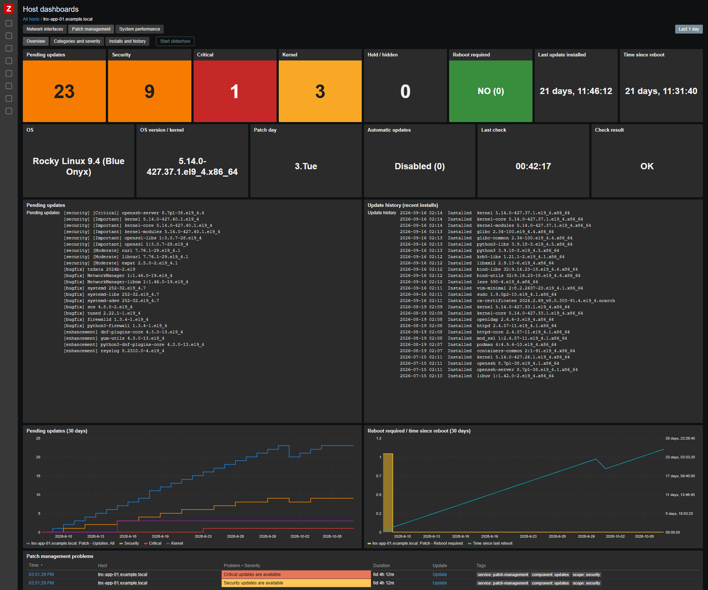
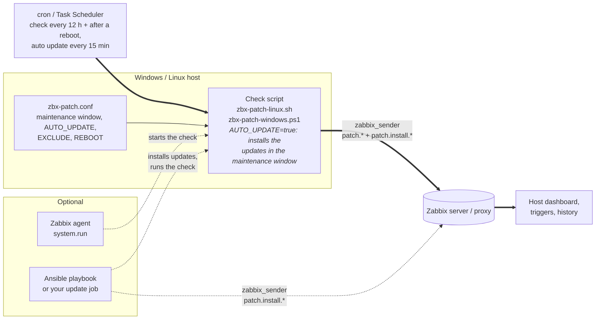
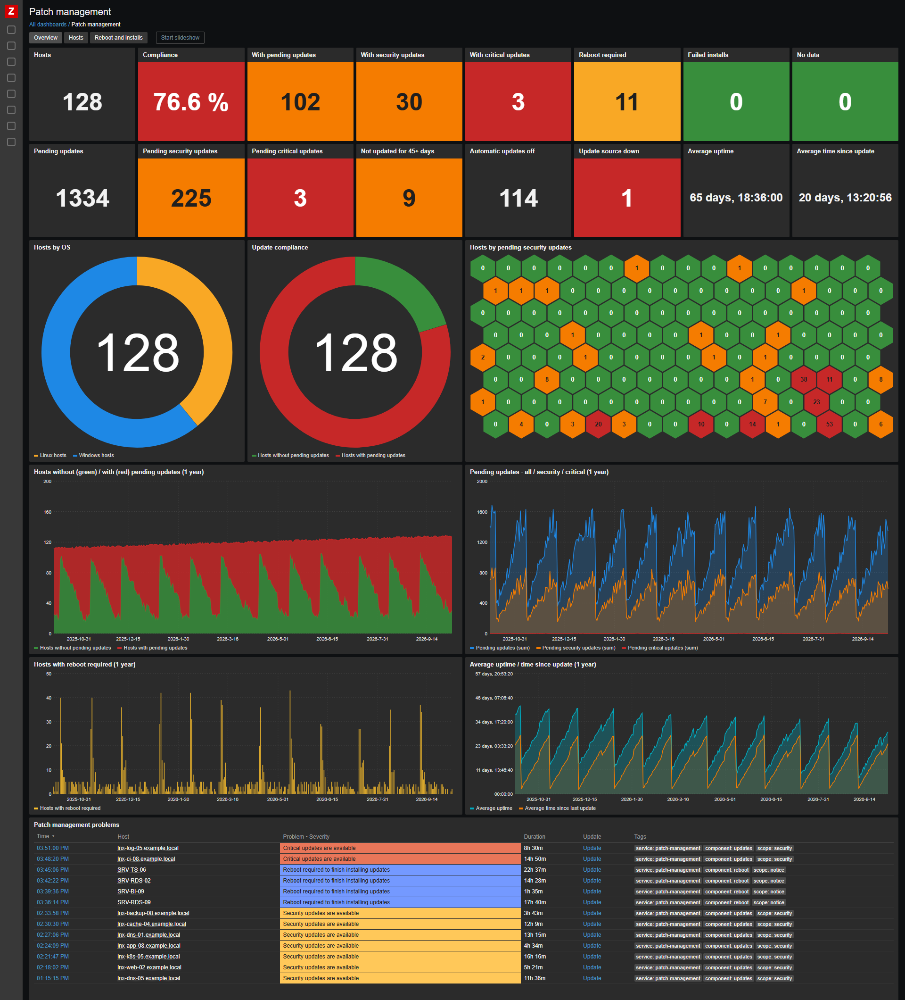
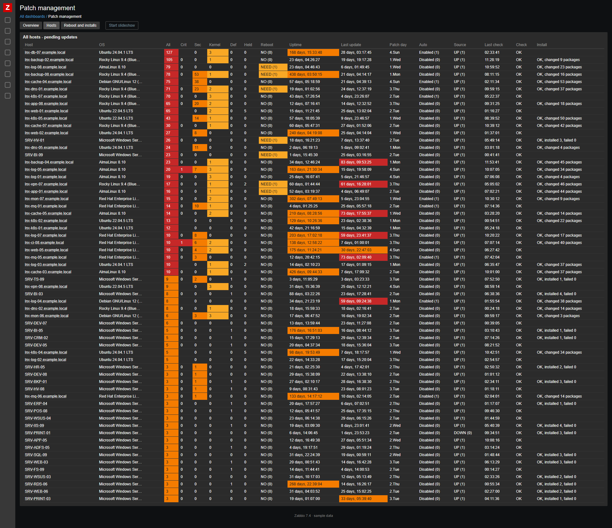
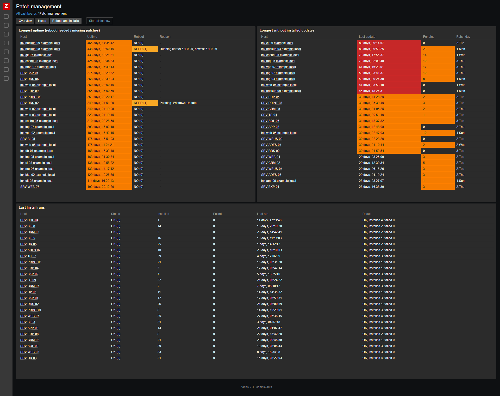

# Zabbix – Patch management for Windows and Linux (template, host dashboard, check scripts, Ansible)

One Zabbix 7.4 template to see the **update status of all your Windows and Linux servers in one place**, with the **same keys on every OS**: how many updates are pending (security, critical, by severity, kernel, …), which ones, what was installed recently, whether a reboot is needed, when the host was last patched and with what result.



*Host dashboard **Patch management**, included in the template (sample data). More screenshots, including the global dashboard of all hosts, are in [Dashboards](#dashboards).*

## ✨ Highlights

- 🪟🐧 **One template for Windows and Linux**: Windows Update, apt (Debian, Ubuntu), dnf / yum (RHEL, Rocky, Alma, Oracle, Fedora). The same keys (`patch.*`), so dashboards, triggers and reports work the same for every OS.
- 📋 **Pending updates** by category (security, critical, bugfix, enhancement, kernel, definition, drivers, …) and **severity** (critical / important / moderate / low), plus the **list of pending updates**
- 📜 **Update history** like a log: what was installed / upgraded / removed and when (Windows Update history, apt history, rpm)
- 🔁 **Reboot required and why**, last reboot time, uptime
- 🛠️ **Last update installed** (detected on the host), result of the last install run (Ansible, the check script or your own job)
- 🗓️ **Maintenance window per host** (`zbx-patch.conf`): for example `3 03:00-05:00` = every Wednesday 03:00–05:00, plus **excluded updates** and **reboot allowed** – shown in Zabbix, used by the install job
- 🤖 **Optional automatic updates by the check script**: with `AUTO_UPDATE="true"` it installs the updates itself in the maintenance window (once per window), reboots when allowed and reports the result – no other tool needed. Off by default (check only).
- 🖥️ **OS name and version / kernel**, update source and its availability, **how updates are installed automatically** (disabled / OS security only / OS all / patch management), Windows Update service
- 📊 **Host dashboard** included in the template: tiles, pending updates list, update history, graphs by category and severity, install runs, patch settings
- 🚨 **Triggers**: critical / security updates pending, reboot required / pending too long, update source unavailable, check failed, install run failed, invalid maintenance window, OS and patch management both installing updates, **no data from a host**
- 🧰 **Works your way**: the check runs from cron / Task Scheduler (or the Zabbix agent) with zabbix_sender. Updates are installed by the **check script itself** (`AUTO_UPDATE`), by **Ansible** (playbook included) or any other tool – or use **only the reporting** with the setup scripts.
- 🤝 **Support and complete deployment** available – see [Support](#support-deployment--custom-work).

## How it works



1. **Check** (`patch.*` items) – the main path: cron / Task Scheduler runs the check script on the host every few hours and it sends everything with zabbix_sender, including the patch settings of the host (`zbx-patch.conf`).
2. **Install** (`patch.install.*` items): with `AUTO_UPDATE="true"` the check script itself installs the updates in the maintenance window and sends the result. Optionally the updates can be installed by the Ansible playbook from this repository or by your own update job, which sends the result the same way.

By default the check script **only reports** (`AUTO_UPDATE="false"`), see [Check only](#check-only-reporting) and [Patch settings](#patch-settings-maintenance-window-automatic-updates-excluded-updates-reboot).

## Contents

| File | Description |
|------|-------------|
| `template_patch_management.yaml` | Zabbix **7.4** export with the template `APP Patch management all OS` (items, triggers, host dashboard) |
| `scripts/zbx-patch-windows.ps1` | Windows check script (PowerShell, Windows Update Agent API); optionally installs the updates (`-Update`, `-AutoUpdate`) |
| `scripts/zbx-patch-linux.sh` | Linux check script (bash, apt / dnf / yum); optionally installs the updates (`--update`, `--auto-update`) |
| `scripts/setup-windows.ps1` | Setup on one Windows host without Ansible (menu: monitor / check / update / force): installs / updates the embedded check script, schedules it (Task Scheduler: check, check after a reboot, automatic update), writes `zbx-patch.conf`, installs the `UserParameter` for the host macros and runs the check |
| `scripts/setup-linux.sh` | The same on Linux (cron) |
| `scripts/embed-check.sh` | Embeds the committed check scripts into the setup scripts |
| `ansible/check-windows.yml`, `ansible/check-linux.yml` | The check script and its schedule with Ansible, for many hosts at once |
| `ansible/patch-and-report.yml` | Ansible playbook: install updates on Windows and Linux, report to Zabbix |
| `ansible/inventory.example.ini` | Example inventory |
| [`old/`](old/README.md) | The original Windows only template `APP Winupdates check` (legacy) |

## Items

Values that exist on only one OS are kept too: on the other OS they are sent as `0` (for example *definition* on Linux, *kernel* on Windows). Values that can't be determined are not sent, so the item stays empty (for example severity on Debian / Ubuntu, because apt has no severity).

| Item | Key | Windows | Linux |
|------|-----|---------|-------|
| Updates: All | `patch.updates.all` | updates and drivers (not hidden) | packages to upgrade / install |
| Updates: Security | `patch.updates.security` | Security Updates | security advisory (dnf / yum), `*-security` suite (apt) |
| Updates: Critical | `patch.updates.critical` | Critical Updates | security advisory with severity Critical (dnf / yum), not sent on apt |
| Updates: Bugfix / Enhancement | `patch.updates.bugfix`, `.enhancement` | Updates / Feature Packs | bugfix / enhancement advisory (dnf / yum), not sent on apt |
| Updates: Kernel | `patch.updates.kernel` | 0 | pending kernel packages |
| Updates: Held / hidden | `patch.updates.held` | hidden updates | `apt-mark hold`, versionlock |
| Updates: Definition, Service packs, Update rollups, Drivers, Upgrades | `patch.updates.definition`, `.servicepacks`, `.updaterollups`, `.drivers`, `.upgrades` | by classification | 0 |
| Severity: Critical / Important / Moderate / Low | `patch.updates.severity.critical`, `.important`, `.moderate`, `.low` | MSRC severity | advisory severity (dnf / yum), not sent on apt |
| Pending updates list | `patch.updates.list` | `[security] [Critical] KB… - title` | `[security] [Important] package version` |
| Update history | `patch.history` | Windows Update history (without definition updates) | `/var/log/apt/history.log`, rpm install time |
| Reboot required / reason | `patch.reboot.required`, `patch.reboot.reason` | Windows Update, Component Based Servicing | `reboot-required`, `needs-restarting`, newer kernel installed |
| Last reboot time / time since | `patch.lastboot`, `patch.lastboot.age` | ✔ | ✔ |
| Last update installed / age / patch day | `patch.lastupdate.timestamp`, `.age`, `.patchday` | detected on the host | detected on the host |
| OS family / name / version | `patch.os`, `patch.os.name`, `patch.os.version` | build with UBR | distribution, running kernel |
| Check script version | `patch.script.version` | `$ScriptVersion` in the script, for example `26.10.10` | `SCRIPT_VERSION` in the script |
| Update source / availability | `patch.source`, `patch.source.available` | Windows Update or `WSUS <server>`, search succeeded | package manager, repositories reachable |
| Automatic updates: 0 disabled, 1 OS security only, 2 OS all updates, 3 patch management (`AUTO_UPDATE`), 4 OS + patch management | `patch.autoupdate` | policy `AUOptions 4` or no policy on a client (2); notify / download only, `NoAutoUpdate`, no policy on Windows Server (0); `AUTO_UPDATE` (3) | unattended-upgrades, dnf-automatic, yum-cron (1 / 2), `AUTO_UPDATE` (3) |
| Automatic updates detail | `patch.autoupdate.detail` | for example `Windows Update: download only, notify to install (AUOptions 3); WSUS http://wsus:8530 (approved updates only)` | for example `unattended-upgrades: security updates only` |
| Windows Update service startup type | `patch.service.startup` | ✔ | not sent |
| Last check time / age / duration / result | `patch.check.timestamp`, `.age`, `.duration`, `.result` | ✔ | ✔ |
| Install run: time, age, status, result, count, failed, list | `patch.install.timestamp`, `.age`, `.status`, `.result`, `.count`, `.failed`, `.list` | install job, Ansible | install job, Ansible |
| Maintenance window / next window | `patch.maintenance.window`, `patch.maintenance.next` | `zbx-patch.conf` | `zbx-patch.conf` |
| Auto update by the check script | `patch.autoupdate.config` | `AUTO_UPDATE` in `zbx-patch.conf` | `AUTO_UPDATE` in `zbx-patch.conf` |
| Config in effect with its source | `patch.config.override` | `[S] window: 1-5 03:00-05:00, [C] auto update: false, [C] reboot: yes, [D] exclude: -` | the same |
| Host macros delivered by the agent | `patch.config[…]` (agent item) | `OK, written / unchanged: …` or `ERROR: …` | the same |
| Excluded updates (config) / pending excluded | `patch.exclude`, `patch.updates.excluded` | KB or a part of the title | package names (wildcards) |
| Reboot allowed | `patch.reboot.allowed` | `zbx-patch.conf` | `zbx-patch.conf` |

**Triggers**: critical updates (High), security updates (Warning), reboot required (Info), reboot pending for more than `{$PATCH.REBOOT.MAXAGE}` (Warning), update source unavailable (Warning), update check failed (Warning), no data for `{$PATCH.NODATA}` (Warning), Windows Update service disabled (Warning), last install run failed (Warning), invalid maintenance window (Warning), updates installed automatically by the OS and by patch management at the same time (Warning); *disabled by default*: no maintenance window configured (Info), updates available (Info), automatic updates disabled (Info), no updates installed for `{$PATCH.LASTUPDATE.MAXAGE}` and updates pending (Warning). All triggers have the tag `service: patch-management`.

All times are sent as unix timestamps, so no time zone macros are needed. The patch day is stored in the host inventory field *Type (Full details)* and used in the trigger tag `UpdatePlan`, so you can filter problems by patch window.

## Dashboards

> 🕵️ The screenshots below show **sample data** (anonymized host names like *SRV-SQL-01* or *lnx-web-02.example.local*). In your Zabbix you see your own hosts; click a host to open its details and history.

### Host dashboard – part of the template ✅

The **host dashboard is included in the template** and is imported with it. Zabbix shows it for every host with the template (*Monitoring → Hosts → Dashboards → Patch management*), with the same widgets on Windows and Linux.

| Overview | Categories and severity | Installs and history |
|:---:|:---:|:---:|
| [](images/host_dashboard_1.png) | [](images/host_dashboard_2.png) | [](images/host_dashboard_3.png) |

### Global dashboard – on request 📨

The **global dashboard of all hosts is not part of this repository** and is not imported with the template (Zabbix can't export a global dashboard together with a template). **I can send it to you on request**, or help you fit it to your environment: 📧 [info@duprtech.sk](mailto:info@duprtech.sk)

| Overview | All hosts | Reboot and installs |
|:---:|:---:|:---:|
| [](images/global_dashboard_1.png) | [](images/global_dashboard_2.png) | [](images/global_dashboard_3.png) |

- **Overview**: hosts, compliance, hosts with pending / security / critical updates, reboot required, failed installs, no data, pending updates totals, hosts not updated for 45+ days, automatic updates off, update source down, average uptime and time since update; hosts by OS, update compliance, honeycomb of hosts by pending security updates; 1 year trends; patch management problems
- **All hosts**: one table of all Windows and Linux hosts – OS, pending updates by category, reboot, uptime, last update, automatic updates (0 disabled … 3 patch management, colored), update source, last check, check and install result, check script version, config in effect with its source (`[S]` Zabbix host macro, `[C]` `zbx-patch.conf`, `[D]` default), next window, excluded updates
- **Reboot and installs**: longest uptime with the reboot reason, longest without installed updates, results of the last install runs

### Host dashboard pages

The template contains the dashboard **Patch management**, shown for every host with the template (*Monitoring → Hosts → Dashboards*):

| Page | Widgets |
|------|---------|
| **Overview** | Tiles: pending / security / critical / kernel / held updates, reboot required, last update installed, time since reboot, automatic updates, automatic updates detail, last check, check result. Pending updates list, update history (recent installs), graphs of pending updates and reboot / uptime (30 days), patch management problems; patch settings: maintenance window, next window, reboot allowed, excluded updates and how many pending updates they match; **Config** – the settings in effect with their source (`[S]` Zabbix host macro, `[C]` `zbx-patch.conf`, `[D]` default) and the result of the agent item for the host macros |
| **Categories and severity** | Pie charts of pending updates by category and by severity, stacked graphs of both (90 days) |
| **Installs and history** | Last install run, status, installed / failed count, last update installed, last reboot, check script version; installed / failed updates per run and time since update / reboot (1 year); history of install runs, installed updates, OS version / kernel and check results |


## Requirements

- Zabbix server / proxy **7.4** or newer, reachable from the hosts on port **10051** (zabbix_sender)
- **Windows**: Zabbix agent 2 (includes `zabbix_sender.exe`), Windows PowerShell 5.1
- **Linux**: `zabbix_sender` (package `zabbix-sender`), bash; `needs-restarting` (dnf-utils / yum-utils) on RHEL for the reboot check
- **Ansible** (optional): `zabbix_sender` on the controller, collection `ansible.windows` for Windows hosts
- The **host name in Zabbix** must match the `Hostname` in the agent config. When the config has no `Hostname` (for example `HostnameItem=system.hostname`), the scripts send `uname -n` (Linux) / the computer name (Windows), or set it yourself (`ZABBIX_HOST` / `-HostName`).

## Installation

### Zabbix
1. Import `template_patch_management.yaml` (*Data collection → Templates → Import*).
2. Link `APP Patch management all OS` to Windows and Linux hosts.

### Windows
1. Copy `scripts/zbx-patch-windows.ps1` to `C:\Program Files\Zabbix Agent 2\scripts\`.
2. Create a scheduled task (as SYSTEM), for example every 6 hours:
   ```powershell
   schtasks /Create /TN "Zabbix patch check" /SC HOURLY /MO 6 /RU SYSTEM /TR "powershell.exe -NoProfile -ExecutionPolicy Bypass -File \"C:\Program Files\Zabbix Agent 2\scripts\zbx-patch-windows.ps1\""
   ```
3. Test it: `powershell -NoProfile -ExecutionPolicy Bypass -File "C:\Program Files\Zabbix Agent 2\scripts\zbx-patch-windows.ps1"`. The update search can take a few minutes.

Parameters: `-SenderPath`, `-ConfigPath` (agent config with `Hostname` and `ServerActive`), `-ZabbixServer`, `-HostName`, `-HistoryLines` (default 50), `-IncludeDefinitionHistory`, `-PatchConfig` (default `zbx-patch.conf` next to the agent config), `-ShowConfig`, `-Update`, `-Force`, `-AutoUpdate`, `-ZabbixConfig`, `-InstallAgentConfig` (see [Patch settings](#patch-settings-maintenance-window-automatic-updates-excluded-updates-reboot)). The setup script below creates the tasks for you, including the automatic update task.

### Linux
1. Copy the script and make it executable:
   ```bash
   install -m 755 zbx-patch-linux.sh /usr/local/bin/zbx-patch-linux.sh
   ```
2. Run it from **cron as root** (root can refresh the package lists), for example `/etc/cron.d/zbx-patch-linux`:
   ```
   0 */6 * * * root /usr/local/bin/zbx-patch-linux.sh >/dev/null 2>&1
   @reboot root sleep 300; /usr/local/bin/zbx-patch-linux.sh >/dev/null 2>&1
   # only needed for automatic updates (AUTO_UPDATE="true" in /etc/zabbix/zbx-patch.conf)
   */15 * * * * root /usr/local/bin/zbx-patch-linux.sh --auto-update >>/var/log/zbx-patch-update.log 2>&1
   ```
3. Test it: `/usr/local/bin/zbx-patch-linux.sh`

Environment variables: `ZABBIX_SENDER`, `ZABBIX_CONF`, `ZABBIX_SERVER`, `ZABBIX_HOST`, `HISTORY_LINES` (default 50), `PATCH_CONF` (default `/etc/zabbix/zbx-patch.conf`), `PATCH_CONF_MACRO`. Options: `--show-config`, `--update`, `--force`, `--auto-update`, `--zabbix-config`, `--install-agent-config` (see [Patch settings](#patch-settings-maintenance-window-automatic-updates-excluded-updates-reboot)).

### Check only (reporting)

The check scripts **by default only read the update status and send it to Zabbix – they don't install or change anything** (on Linux they refresh the package lists, like the system does itself). Updates are installed only when you set `AUTO_UPDATE="true"` in the [patch settings](#patch-settings-maintenance-window-automatic-updates-excluded-updates-reboot). So you can use them on their own:

- if you **only want the reporting**, because updates are installed by another tool (WSUS, SCCM, Intune, AWX, unattended-upgrades, dnf-automatic, …) or by hand,
- to **run the check more often** than your install job (for example every 4 hours, while patching runs once a month).

The setup scripts **`scripts/setup-linux.sh`** and **`scripts/setup-windows.ps1`** do everything on one host without Ansible. The check script is **embedded** in them, so they need no internet access – copy the file to the host or paste it into a root shell / PowerShell as administrator. A menu asks what to do:

| Choice | What it does |
|--------|--------------|
| **1 monitor** (default) | installs the check script, schedules it every 12 h (shifted by a fixed per-host offset of ±30 min, so the hosts don't run at the same time) and after a reboot, schedules the automatic update (it does nothing until `AUTO_UPDATE="true"`), writes `zbx-patch.conf` (shows the current values and asks whether to keep them), installs the `UserParameter` for the [settings from Zabbix](#settings-from-zabbix-host-macros) and runs the check right away |
| **2 check** | runs the check now and shows the patch settings |
| **3 update** | installs the updates now – only in the maintenance window, without `EXCLUDE`, reboots when needed and `REBOOT="yes"`, result to Zabbix |
| **4 force** | like 3, also outside the maintenance window |

**Running it again updates an installed host**: the check script, the schedule and new settings in `zbx-patch.conf` – the values already in the file are kept.

**Windows** (PowerShell as administrator; needs the Zabbix agent 2 with `zabbix_sender.exe`):
```powershell
powershell.exe -NoProfile -ExecutionPolicy Bypass -File setup-windows.ps1
$env:ZBX_PATCH_MODE = 'update'; powershell.exe -NoProfile -ExecutionPolicy Bypass -File setup-windows.ps1   # without the menu
```
Creates the scheduled tasks *Zabbix patch check* (also after a reboot) and *Zabbix patch auto update* (SYSTEM).

**Linux** (as root; installs `zabbix-sender` when missing, if the Zabbix repository is configured):
```bash
sudo bash setup-linux.sh
sudo MODE=update bash setup-linux.sh          # without the menu
sudo INTERVAL_HOURS=4 bash setup-linux.sh     # check every 4 hours
curl -fsSL https://raw.githubusercontent.com/DuprTECH/Zabbix-Patch-Management-Windows-Linux/main/scripts/setup-linux.sh | sudo bash   # no terminal: 1 monitor, settings kept / defaults
```
Creates `/etc/cron.d/zbx-patch-linux` (check, check after a reboot, auto update).

A newer check script can be used without a new setup script: put it to `/tmp/zbx-patch-linux.sh` (Windows: `%TEMP%` or `C:\Temp\zbx-patch-windows.ps1`) – it wins over the embedded one. After a change of the check scripts, `bash scripts/embed-check.sh` embeds the committed version into the setup scripts.

**Many hosts with Ansible**: `ansible/check-windows.yml` and `ansible/check-linux.yml` install the check script and the same schedule (the check script is downloaded on the controller, so the hosts don't need internet access). They don't write `zbx-patch.conf` – without it the hosts only report (create it with the setup scripts, with the [host macros](#settings-from-zabbix-host-macros) or by hand). They install the `UserParameter` for the host macros and restart the agent when it changed:
```bash
ansible-playbook -i inventory.ini ansible/check-linux.yml
ansible-playbook -i inventory.ini ansible/check-windows.yml -e zabbix_check_interval_hours=4
```

### Patch settings: maintenance window, automatic updates, excluded updates, reboot

Each host can have its own settings in **`zbx-patch.conf`** – Linux `/etc/zabbix/zbx-patch.conf`, Windows `<Zabbix agent folder>\zbx-patch.conf` (the same format on both):

```bash
# when updates may be installed and the host rebooted, local time of the host, several separated by commas
#   day: 1-7 = Monday-Sunday (or Mon..Sun), a range 1-5, * = every day, 2.3 = 2nd Wednesday of the month
#   an end lower than the start = the window ends the next day; empty = any time
MAINTENANCE_WINDOW="3 03:00-05:00"          # every Wednesday 03:00-05:00
# true = the check script installs the updates itself in the maintenance window; false = check only (default)
AUTO_UPDATE="false"
# updates that are not installed, separated by commas
#   Linux: package names, wildcards allowed; Windows: KB number or a part of the title
EXCLUDE="kernel*, docker-ce"
# reboot after updates when needed: yes / no (no = the reboot is only reported)
REBOOT="yes"
```

- The **check scripts** send the settings to Zabbix (*Maintenance window*, *Next maintenance window*, *Auto update (zbx-patch.conf)*, *Excluded updates*, *Reboot allowed*) and mark the pending updates that match `EXCLUDE` with `(excluded)` (count in *Updates: Excluded*).
- **Automatic updates** (`AUTO_UPDATE="true"`): the check script is also started every 15 minutes with `--auto-update` / `-AutoUpdate` (cron / task *Zabbix patch auto update*). Outside the window (or with `false`) it exits right away; in an open window it installs the updates once per window (Linux apt / dnf / yum, Windows Update: security, critical, update rollups, definitions, updates), without `EXCLUDE`, sends the result to the `patch.install.*` items, reboots when needed and `REBOOT="yes"` and checks again after the reboot. Log: `/var/log/zbx-patch-update.log`, `C:\ProgramData\zbx-patch\update.log`.
- **Install now by hand**: `zbx-patch-linux.sh --update` / `zbx-patch-windows.ps1 -Update` (only in the window, with `--force` / `-Force` also outside).
- Your **install job** reads the settings with `zbx-patch-linux.sh --show-config` / `zbx-patch-windows.ps1 -ShowConfig` – JSON with `maintenance_active` (the window is open now), `maintenance_next`, `exclude`, `reboot_allowed` and `auto_update`.
- The **setup scripts** (choice 1 monitor) write the file every time: they show the values already in the file and keep them, or ask for new ones; missing settings get the defaults (window **every night 03:00–05:00**, `AUTO_UPDATE="false"`, `REBOOT="yes"`), so running them again updates an installed host. Or just edit the file – the next run uses the new values – or set the [host macros](#settings-from-zabbix-host-macros) in Zabbix.

### Settings from Zabbix (host macros)

The same settings can be set in Zabbix, per host (or in a template linked to a group of hosts), without access to the host – only the Zabbix agent is needed:

| Macro | Overrides | Values |
|-------|-----------|--------|
| `{$PATCH.CONF.WINDOW}` | `MAINTENANCE_WINDOW` | `3 03:00-05:00`, `1-5 22:00-04:00, 2.Sat 08:00-12:00`; **`1-7` = every day** (the agent doesn't allow `*`), `any` = any time |
| `{$PATCH.CONF.AUTO_UPDATE}` | `AUTO_UPDATE` | `true` / `false` |
| `{$PATCH.CONF.EXCLUDE}` | `EXCLUDE` | `kernel%, docker-ce` – **`%` = wildcard** (the agent doesn't allow `*`), `none` = nothing excluded |
| `{$PATCH.CONF.REBOOT}` | `REBOOT` | `yes` / `no` |

How it works:

1. The agent item *Patch - Settings from host macros (agent)* (active, every 10 min) has the macros in its key – the Zabbix server puts their values of the host into the key, so the agent gets them.
2. The `UserParameter` `patch.config` runs the check script with `--zabbix-config` / `-ZabbixConfig`: it validates the values and writes the set (non empty) ones to **`zbx-patch-from-zbx-host-macro.cache`** next to `zbx-patch.conf` – only when they changed. **`zbx-patch.conf` is never changed from Zabbix**; an invalid value writes nothing (the item shows `ERROR: …` and the trigger *Patch settings in the host macros are invalid* fires).
3. The check script (cron / Task Scheduler) reads `zbx-patch.conf` and then the `.cache` file – **a key from the macros wins**, an empty macro leaves `zbx-patch.conf` in effect. The item *Patch - Config (in effect, with source)* (`patch.config.override`) and the **Config** column / tile of the dashboards show every setting with its source, for example `[S] window: 1-5 03:00-05:00, [C] auto update: false, [C] reboot: yes, [D] exclude: -` – `[S]` = Zabbix host macro (server), `[C]` = `zbx-patch.conf` (config from the setup), `[D]` = set nowhere, the default applies.

The setup scripts and the Ansible playbooks install the `UserParameter` with `zbx-patch-linux.sh --install-agent-config` / `zbx-patch-windows.ps1 -InstallAgentConfig`: a file `zbx-patch-userparameter.conf` in the agent `Include` folder (the main agent config gets an `Include` line only when it has none), the `.cache` file writable by the agent (Linux `root:zabbix 0664`), and a restart of the agent – only when something changed; when the agent doesn't start afterwards, the changes are undone. Without the `UserParameter` the agent item is *not supported* and `zbx-patch.conf` alone applies.

### Zabbix agent instead of cron / Task Scheduler (optional)
The item *Patch - Run update check* (disabled) starts the script through the agent with the command in `{$PATCH.CHECK.CMD}` (needs `AllowKey=system.run[*]`). The default is the Linux script; on Windows hosts set the host macro to `start /low powershell -NoProfile -ExecutionPolicy Bypass -File "C:\Program Files\Zabbix Agent 2\scripts\zbx-patch-windows.ps1"`. Running the Linux script as the zabbix user can't refresh the package lists, so cron as root is recommended.

### Ansible (optional)
1. Copy `ansible/inventory.example.ini` to `inventory.ini` and fill in your hosts.
2. Set `zabbix_server` in the playbook (or with `-e zabbix_server=…`).
3. Run:
   ```bash
   ansible-galaxy collection install ansible.windows
   ansible-playbook -i inventory.ini ansible/patch-and-report.yml
   ansible-playbook -i inventory.ini ansible/patch-and-report.yml -e patch_reboot=false   # no automatic reboot
   ```
The playbook patches 25 % of the hosts at a time (`patch_serial`), reboots when needed (`patch_reboot`), sends the result to the `patch.install.*` items and runs the check script again, so the dashboard shows the new state right away. It doesn't use `zbx-patch.conf` – for maintenance windows and exclusions per host use `AUTO_UPDATE="true"`, or read the settings in your own playbook with `--show-config` / `-ShowConfig`. With `-e zabbix_keys=legacy` (or `both`) it sends to the legacy Windows template in [`old/`](old/README.md).

## Macros

| Macro | Default | Description |
|-------|---------|-------------|
| `{$PATCH.NODATA}` | `2d` | Alert when the check script sends no data for this time |
| `{$PATCH.REBOOT.MAXAGE}` | `7d` | Alert when a reboot is pending for this time |
| `{$PATCH.LASTUPDATE.MAXAGE}` | `45d` | Alert when no updates were installed for this time and updates are pending (trigger disabled by default) |
| `{$PATCH.CHECK.CMD}` | `/usr/local/bin/zbx-patch-linux.sh` | Command of the agent item *Patch - Run update check* |
| `{$PATCH.CONF.WINDOW}`, `{$PATCH.CONF.AUTO_UPDATE}`, `{$PATCH.CONF.EXCLUDE}`, `{$PATCH.CONF.REBOOT}` | empty | Patch settings from Zabbix, override `zbx-patch.conf` – see [Settings from Zabbix](#settings-from-zabbix-host-macros) |

## Notes

- **Test on a few hosts first**, especially on your distributions and Windows versions.
- *Security* on Linux: on Debian / Ubuntu the packages from a `*-security` suite, on RHEL the packages with a security advisory (`updateinfo`).
- The Windows update categories are detected by their classification ID, so it works on Windows in any language.
- The patch day is the day of the **last package change** on the host, so manual installs or daily unattended-upgrades move it too.
- Text items (OS, update source, lists, history, settings) drop unchanged values, but keep one at least every **6 hours** (*Discard unchanged with heartbeat 6h*). Dashboards and the API show the last value only from the last 24 hours (*Max history display period*), so a longer heartbeat would leave the columns empty. If you run the check less often than every 24 hours, raise *Administration → General → GUI → Max history display period*.

## Support, deployment & custom work

🤝 **I provide support for this solution, including a complete deployment** in your environment: Zabbix template and dashboards, check scripts on Windows and Linux hosts, scheduling, Ansible patching with reporting, and the global dashboard of all hosts.

Need something extra? I can extend or customize it for your company's needs, for example approval workflows, staged rollouts, reporting or integration with WSUS, SCCM, Intune or AWX. Feel free to get in touch: 📧 [info@duprtech.sk](mailto:info@duprtech.sk)

If this work makes sense to you, give the repo a ⭐ star or support me on Ko-fi ☕

I'm adding more tools and templates over time, so feel free to [follow me on GitHub](https://github.com/DuprTECH) to see what's new.

[](https://ko-fi.com/duprtech)

## License

[MIT](LICENSE)
